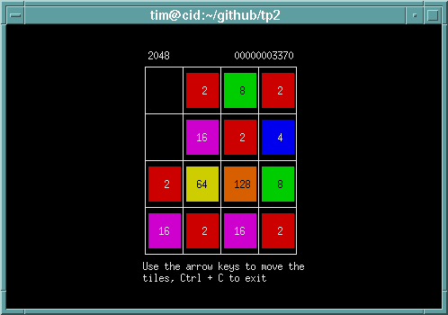
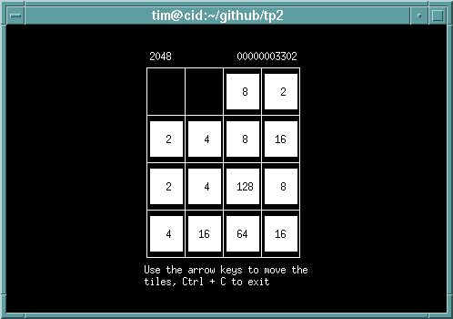
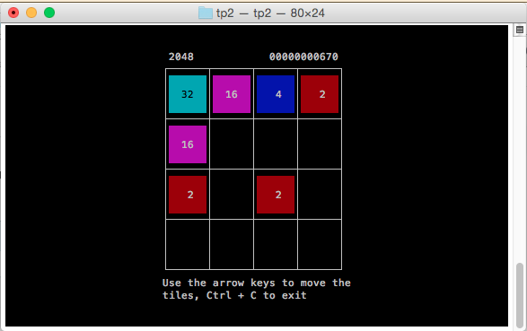
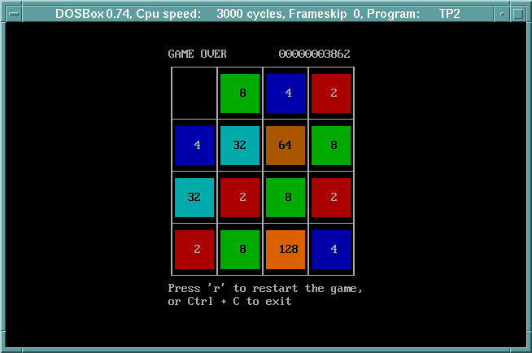

tp2 - Tiled Powers of 2
=======================



Synopsis
--------
```
Usage: ./tp2 [-t game_type] [-b]
	-b:           Black & white mode
	-t game_type: Set the game type.
```

Description
------------

``tp2`` is a simple powers-of-2 tile matching game, based loosely on
[2048](http://gabrielecirulli.github.io/2048/), with a curses UI.

Move the tiles on the board with the arrow keys and match tiles. Each
match produces a tile of the next power of two. The goal of the game is
to reach a certain power of 2.

Matching tiles must be adjacent, and are matched according to the
direction of movement. For example, when moving the board to the left,
the left-most match on each line is made.

The goal is modifiable via the ``-t`` option, and the specified value
should be between 10 (1024) and 15 (32768). The default is 11 (2048).

The game is over when no more matches remain on the board, or the goal
in reached.

Installation
------------

``tp2`` can be installed with the usual ``make`` followed-by
``make install`` routine.

Color Support
-------------

On terminals that support the typical 8 colors, all 8 will be used.
If your terminal supports more than 8 colors (and color redefinition),
additional colors will be defined for tiles above 64, Otherwise,
the default 8 colors are recycled for the higher-numbered tiles.

If your terminal doesn't support color initialization (indicated by
the ``ccc`` and ``initc`` terminal capabilities) but it supports 256
colors, then it's assumed that its palette is xterm-256color compatible,
and xterm color numbers are used for the higher-numbered tiles.

Black & White Mode
------------------

The ``-b`` option disables the use of color. This is the default on
terminals without color support. This mode uses the inverse attribute
instead of colors to render the cells, which hopefully gives a nice,
strong contrast.



Compatibility
-------------

This should compile and run on most systems conforming to SUSv2 or
better and including a XSI-curses compliant curses implementation.

It works on Linux, Mac OS X, and it even works on DOS
(with [pdcurses](http://pdcurses.sourceforge.net).)




Caveats
-------

I haven't tested this will all terminal emulators, but it's working quite
nicely with xterm, tmux, and the Mac OS X Terminal. If the grid doesn't
draw correctly (e.g. it appears as a series of k, l, m, q or x chars)
then it's likely that your terminal emulator doesn't support the
alternate character set normally used for box drawing.

If you're running with ncurses and a UTF-8 locale, you can try
exporting this variable to your environment prior to running ``tp2``:
```
$ export NCURSES_NO_UTF8_ACS=1
```
which tells ncurses to emit UTF-8 equivalents of the box-drawing chars
instead of using the alternate character set.

